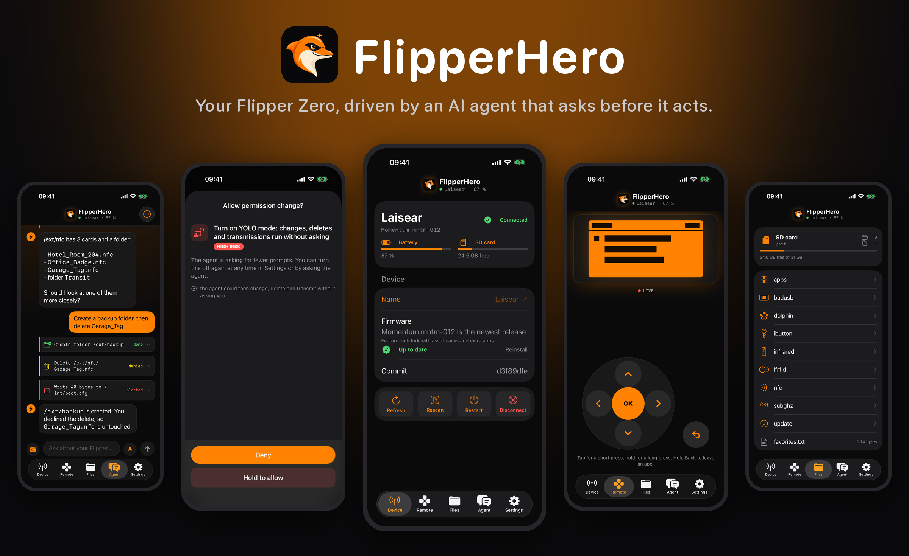
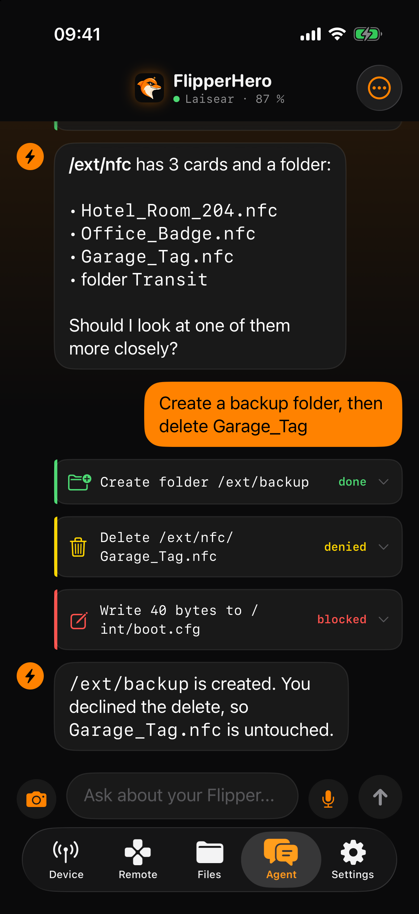
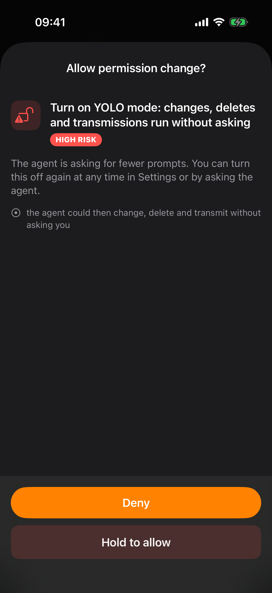
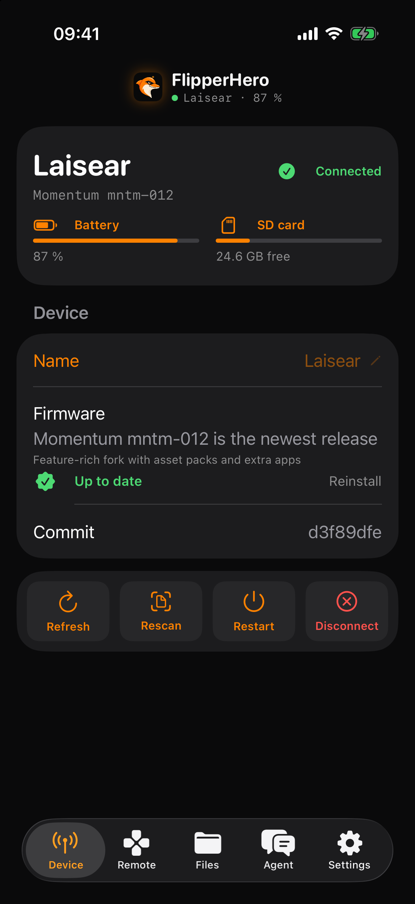
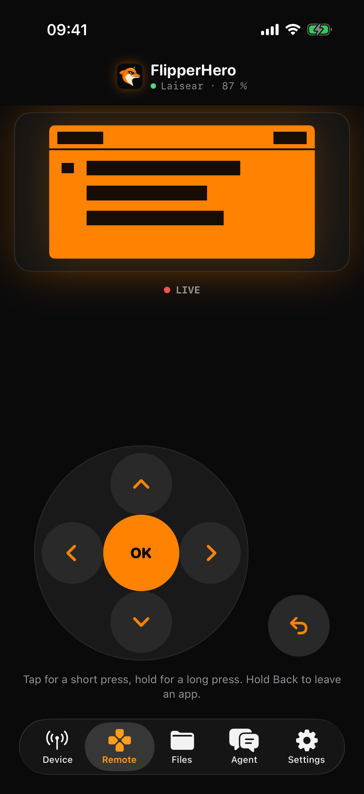
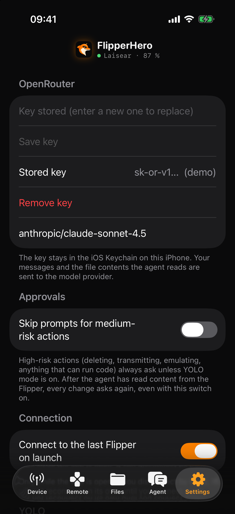
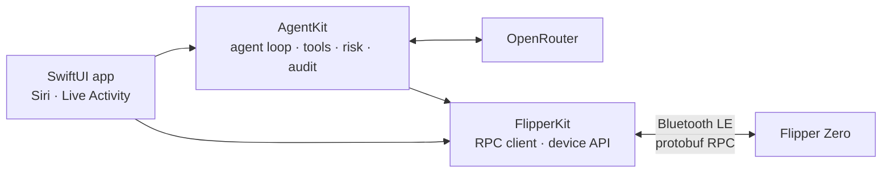

<p align="center">
  
</p>

<p align="center">
  <a href="https://github.com/flipper-hero/ios-app/actions/workflows/ci.yml"></a>
  
  
  
  <a href="LICENSE"></a>
</p>

<p align="center">
  <a href="#features">Features</a> ·
  <a href="#safety-first">Safety</a> ·
  <a href="#siri-and-shortcuts">Siri</a> ·
  <a href="#getting-started">Getting started</a> ·
  <a href="#development">Development</a> ·
  <a href="AGENTS.md">Contributing</a>
</p>

**FlipperHero** is an iPhone app that connects to your Flipper Zero over Bluetooth and lets you run
it in plain language. Ask what is on the SD card, find a TV remote, emulate your office badge, send
the garage signal, install an app or update the firmware. An AI agent does the work, and every
action that matters waits for your approval. The rules for that live in code, not in the model.

Everything the interface can do, the agent can do too. Everything the agent does is shown, checked
and logged.

## Features

<table>
<tr>
<td width="50%" valign="top">

### 💬 Agent chat
Any model on [OpenRouter](https://openrouter.ai) with tool calling. Files, device info, battery,
renaming, restarting, firmware updates, the official app catalog, remotes from GitHub, generated
Flipper files, and Sub-GHz, Infrared, NFC, RFID, iButton and Bad KB.

</td>
<td width="50%" valign="top">

### 🛡️ Approvals you can trust
Risk is computed from the parsed action. Changes ask, physical actions need a press and hold, and
some things are never allowed. See [Safety first](#safety-first).

</td>
</tr>
<tr>
<td valign="top">

### 🎮 Remote control
A live mirror of the Flipper's screen with its D-pad. Tap for a short press, hold for a long one.
The agent can look at the screen and press buttons too.

</td>
<td valign="top">

### 🧠 Knows your device
Firmware, installed apps and saved signals are read on connect, cached per Flipper and handed to
the agent, so it does not go looking every turn.

</td>
</tr>
<tr>
<td valign="top">

### ⬆️ Firmware updates
Recognises Momentum, Unleashed, RogueMaster, Xtreme and official firmware, tells you when a release
is out, and installs it over Bluetooth with battery and space checks.

</td>
<td valign="top">

### 🗣️ Voice, read-aloud and camera
Speak instead of typing, hear answers in the language they were written in, or show the agent a
remote or a label.

</td>
</tr>
<tr>
<td valign="top">

### 🎙️ Siri and Shortcuts
Ask the agent, check the battery, emulate a card, send a signal or stop the running app, with your
saved files offered by name.

</td>
<td valign="top">

### 📍 Live Activity
A running emulation, firmware update or armed engagement stays on the Lock Screen and in the
Dynamic Island, with a button to stop it.

</td>
</tr>
</table>

<p align="center">
  
  
  
  
  
</p>

## Safety first

An agent that can transmit radio and type keystrokes into computers needs guard rails that do not
depend on the model behaving.

| | |
|---|---|
| **Risk comes from code** | Every tool call is parsed and classified by `RiskAssessor`. Reading runs directly, changes ask, and deleting, transmitting, emulating or anything that can run code is high risk and needs a deliberate press and hold. The model never supplies the risk level. |
| **Hard limits** | Internal storage, key and secret files, `..` paths and recursive deletes of top-level folders are blocked, in every mode. The only way past the path guards is `rpc_raw`, which stays locked until you arm engagement mode with raw commands, in a dialog of its own. |
| **Untrusted input is fenced** | File contents, file names, search results and the device inventory are wrapped with a per-session marker and cleaned. Reading any of it taints the turn, and until your next message every change asks again. |
| **No self-promotion** | The agent can explain YOLO mode or engagement mode and offer either, but switching them on always shows you a permission dialog. Turning things off is free. |
| **What you approve is what runs** | Generated files and downloads are shown in full during approval and written exactly as shown. |
| **Siri follows the same rules** | Shortcuts run the same tools with the same checks; where the app would ask, the system confirmation asks. |
| **Everything is audited** | An append-only log in Settings, readable by you and by the agent. |

**YOLO mode** is there if you want it: no prompts for the rest of the session, transmissions
included. Blocked paths stay blocked, by default it still asks right after reading content from the
Flipper, and it resets when the app restarts.

## Red team mode

For an authorized engagement, confirming every step gets in the way. **Engagement mode** is the
answer: you arm the session once, in Settings or by approving the agent's request in chat, and pick
the capabilities you want.

| Capability | What it unlocks |
|---|---|
| **Run actions without prompts** | Changes, transmissions and emulations run without a dialog for the rest of the session. Blocked paths stay blocked. |
| **Bad KB auto-run** | `badusb_execute` starts a DuckyScript on the Flipper itself over RPC: no one has to press Run. Keystrokes go to whatever machine the Flipper is plugged into. |
| **Raw device commands** | `rpc_raw` sends any command from the device's protobuf surface and returns the JSON answer, including commands that bypass the normal path protections. |

Everything else is on the agent already, armed or not: it can operate **any app on the Flipper**
closed-loop, by looking at the screen and pressing its buttons, edit `.sub`/`.ir`/`.txt` signal and
script files directly, drive the **GPIO pins** on the expansion header, and pull files from GitHub
or the app catalog.

What stays, in every mode:

- Only you can arm engagement mode. The agent can request it; the hold-to-arm dialog is yours.
- Arming is session-only: it disarms on disconnect or app restart.
- The scope note you write is shown on the banner and the Lock Screen and given to the agent.
- Every action is still audited, and one tap compiles the audit log into a timestamped markdown
  **engagement report**: what was done, when, and how it was authorized.
- Reading device content still fences it as untrusted, because a prompt-injected agent is an opsec
  problem, not a safety checkbox.

**Two editions.** This repository is the full edition. The App Store edition is built from the
same sources with `FLIPPERHERO_STORE`, which compiles the red team capabilities out entirely:
no Bad KB auto-run, no raw device commands, no GPIO, no engagement mode, and a neutral assistant
prompt. Nothing is hidden behind a switch in the store binary; the capabilities are not in it.
Build it with `scripts/build-store.sh`, see [AGENTS.md](AGENTS.md).

### Roadmap

- [ ] **Wi-Fi Marauder**: drive a Marauder companion app on a GPIO Wi-Fi dev board for passive
  wireless recon, through the same closed-loop app control. Waiting for the dev board.


## Siri and Shortcuts

| Say | What happens |
|---|---|
| “Ask FlipperHero” | Opens the chat with your request and reads the answer back |
| “FlipperHero battery” | Battery level and charging state, without opening the app |
| “Emulate *Office Badge* with FlipperHero” | Emulates a saved NFC, 125 kHz or iButton file until you stop it |
| “Send *Garage* with FlipperHero” | Sends a saved Sub-GHz signal or infrared button once |
| “Stop the Flipper app with FlipperHero” | Ends the running emulation or app |

Actions that need approval ask for confirmation in Siri, and the audit log marks them as coming
from Shortcuts. All phrases are localized.

## Languages

English, Deutsch, Français, Español, Português (Brasil), Italiano, Русский, Українська, Polski,
Türkçe, العربية, हिन्दी, 简体中文, 日本語 and 한국어. The approval dialogs, risk explanations, Siri
phrases and permission prompts are translated too, because safety text you cannot read does not
protect you. The agent answers in whatever language you write in.

Translations were drafted with AI assistance and checked for completeness and placeholders by the
test suite. Corrections from native speakers are very welcome.

## Getting started

**You need** Xcode 26 or newer, an iPhone on iOS 17 or newer (Bluetooth does not work in the
simulator), [XcodeGen](https://github.com/yonaskolb/XcodeGen) and an OpenRouter API key.

```sh
git clone https://github.com/flipper-hero/ios-app.git
cd ios-app
cp Config/Local.xcconfig.example Config/Local.xcconfig   # your team id and bundle id prefix
xcodegen generate
open FlipperHero.xcodeproj
```

Run it on your iPhone, then:

1. Turn on Bluetooth on the Flipper (Settings > Bluetooth).
2. In the Device tab, pick your Flipper and confirm the PIN on both devices the first time.
3. Add your OpenRouter key in Settings. It stays in the iOS Keychain on this iPhone.

The default model is `anthropic/claude-sonnet-4.5`. Any OpenRouter model with tool calling works;
vision-capable models can also use the camera and look at the Flipper's screen.

## Development

```sh
swift test        # FlipperKit and AgentKit: no device, no network
xcodegen generate
xcodebuild test -project FlipperHero.xcodeproj -scheme FlipperHero \
  -destination 'platform=iOS Simulator,name=iPhone 17 Pro' CODE_SIGNING_ALLOWED=NO   # app and UI tests
```

| Layer | Tested how |
|---|---|
| **FlipperKit** | Against a simulated Flipper that answers real protobuf messages: framing, RPC client, file transfer, app control, screen stream, buttons, updates |
| **AgentKit** | Every agent tool runs once through the real executor, and a new tool without a test fails the build. Denied actions provably change nothing. Risk levels, untrusted-content fencing, permissions, firmware packages, catalogs, audit log |
| **Localization** | Every string catalog is checked for all 15 languages and matching placeholders |
| **App** | UI tests click through every screen in demo mode, including the rename limit, the YOLO confirmation and the hold-to-allow dialog |

Bluetooth itself (`BLETransport`) needs an iPhone and a Flipper and is tested by hand.

**Demo mode.** Debug builds launched with `FH_DEMO=1` show sample data without a Flipper or a key.
Add `FH_TAB=0..4`, `FH_DEMO_APPROVAL=1`, `FH_DEMO_YOLO=1`, `FH_DEMO_ACTIVITY=1`,
`FH_DEMO_ENGAGED=1` or `-noSplash` as needed. The screenshots above and `docs/banner.png`
(`scripts/make-banner.py`) come from it.

### Architecture



| Path | What |
|---|---|
| `Sources/FlipperProto` | Generated protobuf types for the Flipper RPC (`scripts/gen-proto.sh`) |
| `Sources/FlipperKit` | Framing, RPC client, device API, CoreBluetooth transport |
| `Sources/AgentKit` | Tools, risk model, approvals, executor, agent loop, OpenRouter, catalogs |
| `App` | SwiftUI app, Siri and Shortcuts; `project.yml` generates the Xcode project |
| `Widgets` | Widget extension with the Live Activity |
| `Shared` | Live Activity types and intents compiled into both the app and the extension |

## Contributing

Read [AGENTS.md](AGENTS.md) first. It holds the parity rule (anything the UI can do, the agent can
do), the safety rules that are not up for negotiation, the localization workflow, and hardware
details that took time to discover. Pull requests need green tests.

Security issues go through private reporting, see [SECURITY.md](SECURITY.md).

## Credits

The Bluetooth layer was written against the Momentum firmware sources and the MIT-licensed
[Flipper iOS app](https://github.com/flipperdevices/Flipper-iOS-App), which served as a protocol
reference. Protobuf definitions come from
[flipperzero-protobuf](https://github.com/flipperdevices/flipperzero-protobuf); only the generated
Swift is in this repository.

## Legal

Use FlipperHero with your own devices and with systems you are allowed to test. Engagement mode
exists for authorized security work: armed sessions are logged end to end, and the report is meant
to be shown to whoever authorized the engagement. What the Flipper may transmit is governed by its
firmware and your local regulations; FlipperHero does not bypass either.

Flipper Zero is a trademark of Flipper Devices Inc. This project is not affiliated with them.

MIT licensed, see [LICENSE](LICENSE).
